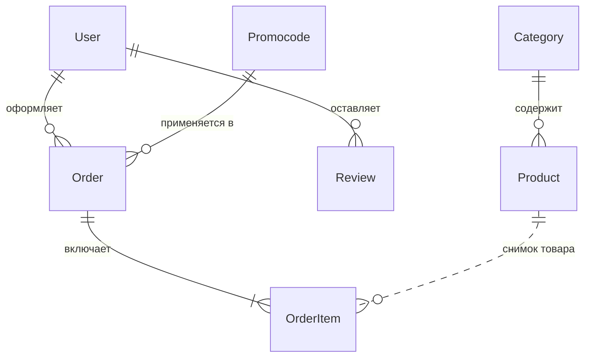

# 🌱 EcoFood — интернет-магазин правильных продуктов

EcoFood — веб-приложение на **Django** для заказа натуральных и экологически чистых продуктов с доставкой по Санкт-Петербургу. В проекте есть каталог с поиском и фильтрами, корзина, оформление заказа с автодополнением адреса (**DaData**), расчётом стоимости доставки по зонам на карте, промокоды, личный кабинет, отзывы-опросы и удобная админ-панель для обработки заказов.

---

## 🎯 О проекте

Спрос на здоровое питание растёт, а небольшие магазины натуральных продуктов часто продают через соцсети и сайты-витрины, где неудобно обрабатывать заказы. EcoFood — готовый минимальный (MVP) интернет-магазин, закрывающий весь основной цикл: от просмотра каталога до доставки и отзыва.

**Целевая аудитория:** люди, следящие за здоровьем и питанием, и те, кто предпочитает заказывать продукты онлайн с доставкой на дом.

### Роли пользователей

| Роль | Возможности |
|------|-------------|
| **Гость** | Просмотр каталога, поиск, фильтры, карточки товаров, отзывы, информационные страницы, наполнение корзины. Для оформления заказа нужно войти или зарегистрироваться. |
| **Покупатель** | Всё, что доступно гостю, плюс оформление заказов, личный кабинет (профиль, история заказов, статусы), отмена заказа, отзывы. |
| **Администратор** | Полный доступ к админ-панели: товары, категории, заказы и их статусы, промокоды, пользователи. |

---

## ✨ Возможности

**Для покупателей**
- 🛒 **Каталог**: поиск по названию, фильтр по категориям (овощи, фрукты, молочные продукты, мясо и птица), сортировка по цене и названию, адаптивная сетка карточек.
- 📄 **Страница товара**: фото, описание, цена, старая цена (скидка).
- 🧺 **Корзина**: добавление/удаление, изменение количества, сумма по позициям и общая сумма. Счётчик товаров в шапке и уведомление о добавлении.
- 📦 **Оформление заказа** в модальном окне:
  - адрес доставки с **автодополнением через DaData** (город → дом) и проверкой наличия номера дома;
  - квартира/офис (только цифры) и комментарий курьеру;
  - **автоматический расчёт стоимости доставки по зонам** (полигоны из GeoJSON, определяется попадание точки адреса в зону);
  - **карта зоны доставки** (Яндекс.Карты);
  - выбор способа оплаты;
  - **промокод** с мгновенным пересчётом итога.
- 🎟️ **Промокоды**: процентная скидка с минимальной суммой заказа.
- 👤 **Регистрация и вход по номеру телефона**; профиль с редактированием данных и персональной статистикой (число заказов, доставленные заказы, дней с нами).
- 🔑 **Восстановление пароля** по email (одноразовая ссылка с ограниченным сроком действия).
- 📋 **«Мои заказы»**: номер, дата, статус, адрес, оплата, промокод, состав, итоги с разбивкой (товары / доставка / скидка), печать заказа и отмена (пока заказ не подтверждён).
- ⭐ **Отзывы-опросы**: оценки по критериям (качество, свежесть, обслуживание, рекомендация), общий рейтинг, процент рекомендаций, прогресс-бары, поле комментария (до 500 символов) и простая арифметическая капча «я не робот».
- 🏠 **Главная** с блоками «О нас», преимуществами, галереей и популярными товарами (по доставленным заказам).
- ℹ️ Страницы **«О нас»**, **«Доставка»** (способы, зоны, график, условия), **«Контакты»** (адрес, телефон, email, соцсети, карта).

**Для администраторов**
- Цветные статусы заказов, быстрые кнопки смены статуса прямо в списке, массовые действия.
- Автоматическая дата доставки при статусе «Доставлен».
- Управление товарами, категориями, промокодами, пользователями.

---

## 🧰 Технологии и архитектура

| Слой | Технология |
|------|-----------|
| Бэкенд | Python 3.10+, Django 5.2.x |
| База данных | PostgreSQL |
| Фронтенд | Шаблоны Django, HTML, CSS, JavaScript, Bootstrap 5.3, Bootstrap Icons |
| Адреса | DaData (подсказки адресов) |
| Карты | Конструктор Яндекс.Карт, GeoJSON-зоны доставки |
| Изображения | Pillow (`ImageField`) |
| Почта | SMTP (Gmail) |

**Архитектура.** Клиент-серверное приложение по шаблону **MTV** (Model–Template–View):

- **Models** описывают данные и бизнес-правила (расчёт суммы заказа, генерация номера, валидация промокода);
- **Views** обрабатывают запросы и формируют ответы (HTML или JSON для AJAX-операций);
- **Templates** генерируют HTML; страницы собираются из базового шаблона и переиспользуемых компонентов.

Страницы рендерятся на сервере, а динамика (корзина, подсказки адреса, расчёт доставки, применение промокода, отправка заказа) реализована JavaScript и асинхронными запросами. 

**Встроенная защита Django:** CSRF-токены, экранирование шаблонов (XSS), ORM (защита от SQL-инъекций), хэширование паролей, проверка прав (`login_required`, `LoginRequiredMixin`).

---

## 📁 Структура проекта

```
shop/
├── manage.py
├── shop/                    # Конфигурация: settings, urls, wsgi, asgi
├── about/                   # Страница «О нас»
├── cart/                    # Страница корзины, utils.py (работа с корзиной в сессии)
├── catalog/                 # Category, Product, каталог, карточка товара, products_data.py
├── contacts/                # Страница контактов
├── delivery/                # Страница доставки
├── homepage/                # Главная страница (популярные товары)
├── orders/                  # Order, OrderItem, Promocode, формы, админка
├── reviews/                 # Review, форма отзыва, reviews_data.py
├── users/                   # Кастомный User, регистрация, вход, профиль, сброс пароля
├── .gitignore
├── media/                   # Загруженные изображения (products/ГГГГ/ММ/ДД/)
├── static_dev/              # Исходники статики
│   ├── css/                 # about, cart, catalog, checkout, contacts, delivery,
│   │                        # header, order_list, product_detail, reviews
│   ├── js/                  # cart.js, cart2.js, catalog.js, checkout.js, reviews.js
│   ├── images/              # no-image.jpg (заглушка)
│   ├── img/icons/           # cart.png
│   └── data.geojson         # Зоны доставки (полигоны + стоимость)
├── static/                  # STATIC_ROOT (создаётся автоматически)
└── templates/
    ├── base.html, index.html, catalog.html, product_detail.html, cart.html,
    │   order_list.html, reviews.html, about.html, contacts.html, delivery.html
    ├── components/          # hero_section, advantages_section, about_section,
    │                        # gallery_section, checkout_modal
    ├── includes/            # header.html, footer.html
    └── users/               # login, register, profile, password_reset*, email_base
```

---

## ✅ Требования

- **Python** 3.10+
- **PostgreSQL** 13+
- **pip** и **venv**
- Аккаунт **DaData** (для подсказок адресов)
- Git (по желанию)

Python-зависимости:

```
Django>=5.2,<5.3
psycopg2-binary
Pillow
python-dotenv
```

---

## 🚀 Установка и запуск

### 1. Получите проект

```bash
git clone EcoFood
```

### 2. Создайте и активируйте виртуальное окружение

**Windows (PowerShell):**
```powershell
python -m venv venv
venv\Scripts\activate
```

**Linux / macOS:**
```bash
python3 -m venv venv
source venv/bin/activate
```

### 3. Установите зависимости

```bash
pip install "Django>=5.2,<5.3" psycopg2-binary Pillow python-dotenv
```

> 💡 `Pillow` обязателен: без него Django не запустится из-за `ImageField` в модели `Product`. `python-dotenv` читает настройки из файла `.env`.

### 4. Создайте базу данных PostgreSQL

```bash
psql -U postgres
```

```sql
CREATE DATABASE ecofood_db;
```

### 5. Настройте переменные окружения (`.env`)

Секреты (пароли, ключи) не хранятся в коде, а читаются из файла `.env`, который не попадает в git.

Скопируйте шаблон и заполните его:

```bash
# Windows (PowerShell)
Copy-Item .env.example .env

# Linux / macOS
cp .env.example .env
```

Содержимое `.env`:

```dotenv
# Секретный ключ Django
DJANGO_SECRET_KEY='ваш_ключ'

DJANGO_DEBUG=1
DJANGO_ALLOWED_HOSTS=127.0.0.1,localhost

# PostgreSQL
DB_NAME=ecofood_db
DB_USER=postgres
DB_PASSWORD=пароль_от_вашего_postgresql
DB_HOST=localhost
DB_PORT=5432

# Почта (Gmail, пароль приложения)
EMAIL_HOST_USER=ваша_почта@gmail.com
EMAIL_HOST_PASSWORD=пароль_приложения
```

Сгенерировать секретный ключ:

```bash
python -c "from django.core.management.utils import get_random_secret_key as g; print(g())"
```
### 6. Примените миграции

```bash
python manage.py migrate
```

> Проект использует **кастомную модель пользователя** (`users.User`). Не удаляйте папки `migrations/` приложений.

### 7. Создайте суперпользователя

Вход выполняется **по номеру телефона**, поэтому будут запрошены телефон, email и имя:

```bash
python manage.py createsuperuser
```

```
Phone: +79991234567
Email: admin@example.com
First name: Admin
Password: ********
```

### 8. Запустите сервер

```bash
python manage.py runserver
```

| Страница | Адрес |
|----------|-------|
| Сайт | http://127.0.0.1:8000/ |
| Админ-панель | http://127.0.0.1:8000/admin/ |

---

## 🔌 Настройка внешних сервисов

### DaData (подсказки адресов)

Автодополнение адреса в форме заказа работает через API подсказок DaData.

1. Зарегистрируйтесь на [dadata.ru](https://dadata.ru) и получите **API-ключ** (токен подсказок).
2. В `static_dev/js/checkout.js` задайте константы (они используются в функции `getAddressSuggestions`):
   ```js
   const DADATA_URL = 'https://suggestions.dadata.ru/suggestions/api/4_1/rs/suggest/address';
   const DADATA_API_KEY = '<ваш-токен>';
   ```

### Зоны доставки (GeoJSON)

Стоимость доставки определяется на клиенте в `checkout.js`:

1. Из DaData берутся координаты выбранного адреса (`geo_lon`, `geo_lat`).
2. Загружается файл `/static/data.geojson` (лежит в `static_dev/`).
3. Алгоритмом «точка в полигоне» (ray casting) определяется зона, в которую попал адрес.
4. Стоимость доставки берётся из поля `properties.description` найденного полигона. Если адрес не попал ни в одну зону, доставка недоступна, а кнопка оформления остаётся неактивной.

> Координаты в GeoJSON задаются в порядке **[долгота, широта]**. Подготовить зоны можно в конструкторе Яндекс.Карт с экспортом в GeoJSON.

### Карта зоны доставки

В `checkout_modal.html` подключён скрипт конструктора Яндекс.Карт. Чтобы показать свою карту, создайте её в [конструкторе карт](https://yandex.ru/map-constructor/) и замените ссылку (параметр `um=constructor:...`).

### Почта (восстановление пароля)

Используется SMTP Gmail (`smtp.gmail.com:587`, TLS). Логин и пароль задаются в `.env`:

```dotenv
EMAIL_HOST_USER=ваша_почта@gmail.com
EMAIL_HOST_PASSWORD=пароль_приложения
```

Пароль приложения: **Аккаунт Google → Безопасность → Двухэтапная аутентификация → Пароли приложений**.

Для разработки без реальной почты письма можно выводить в консоль. Добавьте в `.env`:

```dotenv
EMAIL_BACKEND=django.core.mail.backends.console.EmailBackend
```

---

## 🗂️ Первичное наполнение данными

Данные добавляются через админ-панель (`/admin/`):

1. **Категории** (`Каталог → Категории`): название и slug.
   Примеры: `vegetables` — Овощи, `fruits` — Фрукты, `dairy` — Молочные продукты, `meat` — Мясо и птица.
   > При первом открытии `/catalog/` при пустой базе автоматически создаются эти 4 категории.
2. **Товары** (`Каталог → Товары`): название, описание, цена, категория, при желании старая цена. Изображение: **загрузите файл** *или* **вставьте ссылку** (при заполнении обоих приоритет у файла). Без изображения подставляется `static/images/no-image.jpg`. 
3. **Промокоды** (`Заказы → Промокоды`): код, процент скидки, минимальная сумма, активность. Пример: `WELCOME10` — 10 %, от 500 ₽.

> 📷 Папка `media/` (загруженные фото товаров) не хранится в репозитории (она в `.gitignore`), поэтому после клонирования загрузите изображения заново через админку или используйте ссылки на изображения.

Блок популярных товаров на главной заполняется после первых заказов со статусом «Доставлен».

---

## 🔗 Маршруты (URL)

| URL | Назначение |
|-----|-----------|
| `/` | Главная страница |
| `/catalog/` | Каталог |
| `/catalog/<id>/` | Карточка товара |
| `/cart/` | Корзина |
| `/about/` | О магазине |
| `/delivery/` | Доставка |
| `/contacts/` | Контакты |
| `/reviews/` | Отзывы и форма оценки |
| `/users/register/` | Регистрация |
| `/users/login/` | Вход по телефону |
| `/users/logout/` | Выход |
| `/users/profile/` | Профиль |
| `/users/password-reset/` | Восстановление пароля |
| `/orders/` | Мои заказы |
| `/orders/create/` | Создание заказа (POST, JSON) |
| `/orders/<id>/cancel/` | Отмена заказа (POST) |
| `/orders/promocode/apply/` | Применить промокод (POST) |
| `/orders/promocode/remove/` | Снять промокод |
| `/admin/` | Админ-панель |

---

## 🗃️ Модель данных

Реляционная модель из семи сущностей.



### User
| Поле | Тип | Описание |
|------|-----|----------|
| `phone` | varchar(20), unique | Телефон, основной логин |
| `email` | email, unique | Почта (восстановление пароля) |
| `first_name` | varchar(30) | Имя |
| `date_of_birth` | date, null | Дата рождения |
| `password` | varchar(128) | Хэш пароля |
| `is_active`, `is_staff`, `is_superuser` | boolean | Флаги доступа |
| `last_login`, `date_joined` | datetime | Даты входа и регистрации |

### Category
`slug` (unique), `name`.

### Product
`name`, `description`, `price`, `old_price` (null), `category` (FK), `image_url`, `image_file`, `in_stock`.
Свойство `image` возвращает: загруженный файл → ссылку → заглушку.

### Order
| Поле | Описание |
|------|----------|
| `order_number` | Уникальный номер `ORD-ГГГГММДД-XXXXXXXX` (генерируется автоматически) |
| `user` | FK на пользователя (каскадное удаление) |
| `total_amount`, `delivery_cost`, `discount_amount`, `final_amount` | Суммы. `final_amount = total_amount + delivery_cost − discount_amount` (считается в `save()`) |
| `delivery_address`, `apartment`, `delivery_comment` | Доставка |
| `customer_name`, `customer_phone`, `customer_email` | Получатель (по умолчанию из профиля) |
| `payment_method` | Способ оплаты |
| `promocode` | FK, `SET_NULL` (история скидок сохраняется) |
| `status` | Статус заказа |
| `created_at`, `updated_at`, `delivered_at` | Даты |

### OrderItem
`order` (FK), `product_id`, `product_name`, `product_price`, `quantity`, `total_price = price × quantity`.
Хранится **«снимок» товара** на момент покупки: позднее изменение или удаление товара в каталоге не влияет на уже оформленные заказы.

### Promocode
`code` (unique), `discount_percent`, `min_order_amount`, `is_active`.
Методы: `is_valid(order_amount)` — проверка активности и минимальной суммы; `calculate_discount(order_amount)` — `сумма × процент / 100` с округлением до копеек (`Decimal`).

### Review
`author_name`, `title`, `user` (FK, null), `product_quality`, `product_freshness`, `service_quality`, `recommend` (оценки 1–5), `calculated_rating` (среднее арифметическое оценок), `comment`, `created_at`.

### Статусы заказа

```
pending → processing → cooking → delivering → delivered
   └──────────┴─────────→ cancelled
```

| Код | Название | Цвет в админке |
|-----|----------|----------------|
| `pending` | Ожидает подтверждения | оранжевый |
| `processing` | В обработке | синий |
| `cooking` | Готовится | фиолетовый |
| `delivering` | Доставляется | голубой |
| `delivered` | Доставлен | зелёный |
| `cancelled` | Отменён | красный |

### Способы оплаты

| Код | Название |
|-----|----------|
| `cash` | Наличными при получении |
| `card` | Банковской картой онлайн |
| `card_courier` | Картой курьеру |

---


## 📸 Скриншоты

### Покупатель (десктоп)

| Главная страница | Каталог |
|:---:|:---:|
|  |  |

| Выбор категории | Карточка товара |
|:---:|:---:|
|  |  |

| Товар добавлен в корзину | Корзина |
|:---:|:---:|
|  |  |

| Оформление заказа | Мои заказы |
|:---:|:---:|
|  |  |

### Администратор

| Панель администратора | Список заказов |
|:---:|:---:|
|  |  |

| Подробная информация о заказе | Подтверждённый заказ |
|:---:|:---:|
|  |  |

### Мобильная версия

| Главная и меню | Каталог | Товары категории |
|:---:|:---:|:---:|
|  |  |  |

| Корзина | Оформление заказа | Мои заказы |
|:---:|:---:|:---:|
|  |  |  |


---

<p align="center">Сделано с 💚 для тех, кто выбирает правильное питание</p>
